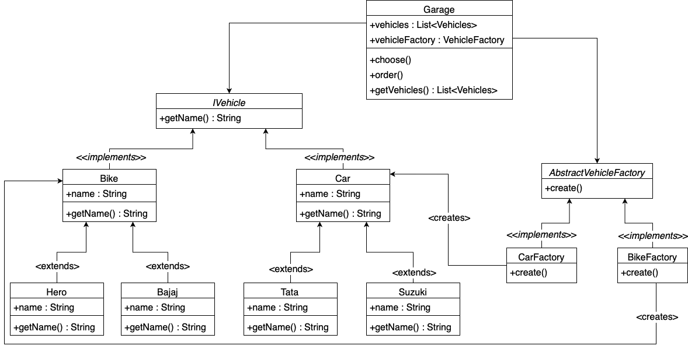

# Abstract Factory Pattern example using Test Driven Development

## Example (Garage):
* There is an owner who is pretty much obsessed with different kinds of vehicles, he wants to buy as many vehicles as possible to store them in his garage.
* For that, he wants to visit a nearby vehicle store to buy a brand-new kind of vehicle every time.
* He likes all kinds of vehicles, but they should be differentiated with the number of wheels they have.
* So, he wants different types of vehicles as per the company names.

## Class diagram:

